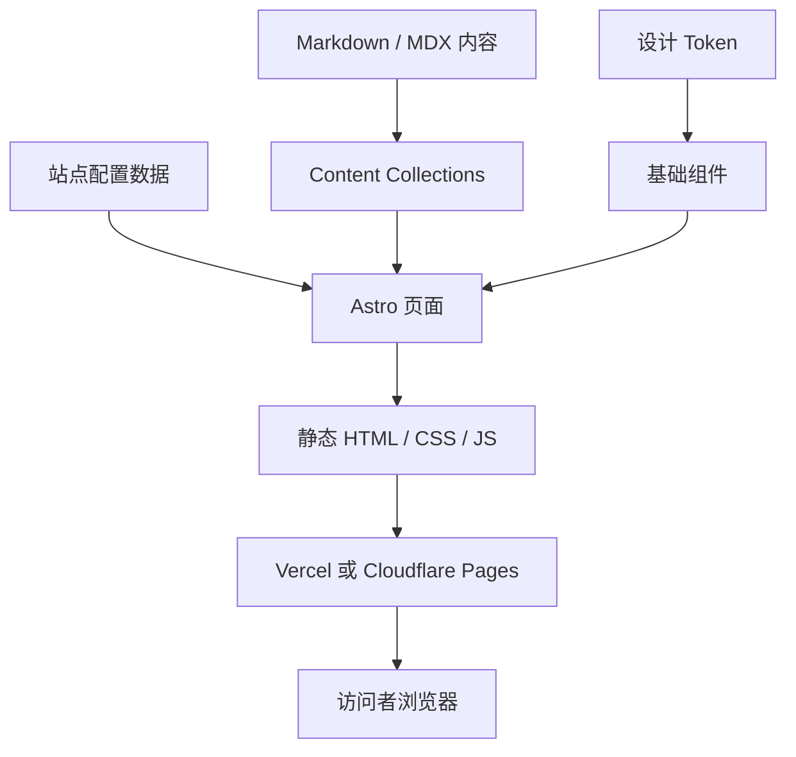

# 阿川 Blog 技术架构文档

## 1. 文档目的
本文档定义阿川 Blog 第一版网站的技术架构，供后续开发、AI 协作和长期维护使用。
依据文件包括 `brief.md`、`prd.md`、`design.md`。
本文档不重新定义产品目标和视觉风格，只把它们转化成可执行的技术方案。

## 2. 架构原则
- 内容优先：技术选择必须服务文章、作品、学习经历和成长路径。
- 长期维护：网站要支持未来五年的持续更新。
- 低复杂度：第一版不引入数据库、账号系统、后台系统和复杂服务端。
- 可扩展：后续可以自然增加标签、RSS、搜索、作品详情页等能力。
- AI 友好：目录、数据结构和组件边界必须清晰，减少 AI 生成时的歧义。
- 真实可信：不得虚构未确认的个人信息、链接和经历。

## 3. 总体技术选型
推荐第一版采用静态内容站架构。
```text
框架：Astro
语言：TypeScript
内容：Markdown / MDX
内容管理：Astro Content Collections
样式：CSS Variables + Tailwind CSS
组件：Astro 组件为主，必要时少量 React
部署：Vercel 或 Cloudflare Pages
版本管理：Git + GitHub
包管理：pnpm
```
核心方式：内容以文件形式存放在仓库中，构建时生成静态 HTML，部署到静态托管平台。
第一版默认不需要数据库，也不需要服务端运行时。

## 4. 为什么选择 Astro
Astro 适合内容型网站，尤其适合个人博客、作品集和文档站。
阿川 Blog 的核心是文章、作品、学习经历、成长路径和个人介绍，这些内容天然适合静态生成。
Astro 支持 Markdown、MDX 和 Content Collections，方便长期写作和结构化管理内容。
Astro 的 Islands 架构允许只在必要的局部加载 JavaScript，符合 design.md 中“内容优先、克制表达、低干扰”的要求。
相比纯 React 单页应用，Astro 更轻、更适合 SEO 和首屏阅读。
相比更重的全栈框架，Astro 不会在第一版引入不必要的服务端复杂度。

## 5. 总体架构图

## 6. 推荐目录结构
```text
achuanblog/
  src/
    assets/
    components/
      base/
      sections/
      content/
    content/
      articles/
      works/
      experience/
      growth/
    data/
    layouts/
    pages/
    styles/
    utils/
  public/
  brief.md
  prd.md
  design.md
  architecture.md
```
## 7. 目录职责
`src/assets/`：存放需要构建处理的图片和资源。
`src/components/`：存放可复用组件，按 base、sections、content 分层。
`src/content/`：存放文章、作品、学习经历和成长路径。
`src/data/`：存放站点配置、导航、社交链接等结构化数据。
`src/layouts/`：存放页面布局模板。
`src/pages/`：存放路由页面。
`src/styles/`：存放设计 token、全局样式和文章正文样式。
`src/utils/`：存放排序、筛选、日期格式化等工具函数。
`public/`：存放 favicon、robots.txt、公开静态文件等不需要构建处理的资源。

## 8. 页面路由
```text
/                  首页
/about             关于我
/experience        学习经历
/growth            成长路径
/works             作品集
/articles          文章列表
/articles/[slug]   文章详情
/contact           联系
```
URL 使用英文，页面导航和标题使用中文。
这样既方便部署、分享和 SEO，也不影响中文用户理解。

## 9. 导航结构
导航建议由 `src/data/navigation.ts` 统一维护。
```text
首页
关于我
学习经历
成长路径
作品集
文章
联系
```
不要在各页面重复手写导航。
不要新增 PRD 未确认的栏目，例如照片、音乐、菜谱、订阅等。

## 10. 内容集合总览
使用 Astro Content Collections 管理结构化内容。
建议建立四个集合：`articles`、`works`、`experience`、`growth`。
每个集合都要定义 schema，用来约束字段，避免 AI 或开发时随意发明字段。

## 11. articles 集合
用途：承载 AI Agent、读书笔记、AI 实践案例等长期文章。
```ts
title: string
description: string
date: Date
updated?: Date
category: "AI Agent" | "读书笔记" | "AI 实践案例" | "其他"
tags: string[]
draft: boolean
featured: boolean
cover?: image
```
普通文章使用 Markdown。
需要插入复杂组件时才使用 MDX。
文章页的 SEO 标题和描述应来自 frontmatter。

## 12. works 集合
用途：展示 GitHub 项目、小工具和文章作品。
```ts
title: string
description: string
type: "GitHub 项目" | "小工具" | "文章" | "其他"
date: Date
tags: string[]
url?: string
repo?: string
featured: boolean
cover?: image
```
没有真实链接时不要虚构。
第一版可以先做作品列表，不必立即做 `/works/[slug]` 详情页。

## 13. experience 集合
用途：呈现正式教育背景和工作经历，偏事实性，不负责讲成长故事。
```ts
title: string
period: string
institution?: string
location?: string
type: "教育经历" | "工作经历" | "其他"
description: string
links?: { label: string; url: string }[]
order: number
```
使用 `order` 控制展示顺序，不只依赖日期字符串。
这能兼容“本科阶段”“某段实习”“自学阶段”等非标准时间表达。

## 14. growth 集合
用途：描述作者如何一步步成为现在的自己，更偏叙事，展示关键节点和转折。
```ts
title: string
date?: Date
period?: string
summary: string
theme: "写作" | "AI" | "学习" | "创作" | "其他"
order: number
featured: boolean
```
正文可以使用 Markdown。
当前先用 `order` 排序，后续可改为时间线或主题分组。

## 15. 站点配置
建议创建 `src/data/site.ts`，统一维护站点基础信息。
```ts
export const site = {
  name: "阿川 Blog",
  id: "achuanblog",
  author: "阑梦清川",
  role: "AI 爱好者和内容创作者",
  description: "阑梦清川的个人博客与个人门面。"
}
```
站点名、作者名、身份描述等基础信息统一从这里读取。
不要在每个页面中重复硬编码。

## 16. 社交链接
建议创建 `src/data/social.ts`。
计划支持 GitHub、X、个人邮箱和其他社交媒体。
具体链接尚未确认前，不得虚构。
```ts
{
  label: "GitHub",
  url: "",
  enabled: false
}
```
页面只展示 `enabled: true` 的链接，避免把占位链接发布出去。

## 17. Layout 设计
建议至少建立三个布局：`BaseLayout.astro`、`PageLayout.astro`、`ArticleLayout.astro`。
`BaseLayout` 负责 HTML 基础结构、meta、Header、Footer 和全局样式。
`PageLayout` 负责普通页面的标题、描述、容器宽度和区块间距。
`ArticleLayout` 负责文章标题、日期、标签、分类和正文阅读体验。
文章正文最大宽度必须遵守 design.md 的 `contentMaxWidth`。
文章页不要放大型侧栏。

## 18. 组件分层
组件分三层：`base` 基础组件、`sections` 页面区块组件、`content` 内容渲染组件。
```text
base: Container, Button, Tag, Card, SectionHeader, IconLink
sections: HeroSection, AboutPreview, GrowthPreview, WorksPreview, LatestArticles, ContactSection
content: ArticleCard, WorkCard, ExperienceItem, GrowthTimelineItem, ArticleMeta
```
页面应尽量组合组件，不在页面文件里堆大量样式和逻辑。

## 19. 样式架构
使用 CSS Variables 承接 design.md 的 token。
Tailwind CSS 用于布局、间距和常规样式组合。
```text
src/styles/tokens.css
src/styles/global.css
src/styles/prose.css
```
`tokens.css` 定义颜色、间距、圆角、阴影。
`global.css` 定义全站基础样式。
`prose.css` 定义文章正文样式。
不要在组件中随意写新的颜色值。

## 20. 设计 Token 映射
```css
:root {
  --color-primary: #4258ff;
  --color-primary-hover: #2942ff;
  --color-primary-soft: #edf3ff;
  --color-page-hero: #d9f1ff;
  --color-surface: #ffffff;
  --color-neutral: #404654;
  --color-neutral-strong: #1f2937;
  --color-neutral-muted: #6b7280;
  --color-border-subtle: #e5e7eb;
}
```
这样做的好处是：设计风格有统一来源，后续换颜色时不需要全站搜索替换。

## 21. 响应式策略
采用移动端优先。
移动端全部主要内容单列展示。
桌面端可以在作品、经历等列表中使用两列。
文章页在所有屏幕上都应优先保证阅读体验。
关键断点为 `768px` 和 `1024px`。
不要为了桌面视觉效果牺牲移动端可读性。

## 22. 首页实现策略
首页从多个数据源组合生成。
```text
Hero：来自 site 配置
About preview：来自页面内容或 site 配置
Growth preview：来自 growth 集合 featured 项
Works preview：来自 works 集合 featured 项
Latest articles：来自 articles 集合最新文章
Contact：来自 social 配置
```
首页不要手动复制文章、作品和成长路径内容。
这样后续新增内容时，首页能自动更新。

## 23. SEO 架构
每个页面必须提供 `title`、`description`、Open Graph 标题和描述。
有域名后再配置 canonical URL。
首页 SEO 应突出：阿川 Blog、阑梦清川、AI 爱好者、内容创作者、AI Agent。
不要堆砌关键词。
文章页 SEO 信息来自文章 frontmatter。

## 24. Sitemap 和 robots
建议接入 Astro Sitemap，构建时自动生成 sitemap。
`robots.txt` 初期可以允许搜索引擎抓取。
如果上线时仍存在大量占位内容，可临时限制抓取，正式完善后再开放。

## 25. 性能目标
第一版以静态渲染为主，非必要 JavaScript 不加载。
图片需要压缩并设置尺寸。
字体加载不应阻塞主要内容。
不使用复杂动画和大体积动效库。
建议 Lighthouse 目标：Performance 90+、Accessibility 90+、Best Practices 90+、SEO 90+。
这些指标不是为了追分，而是为了避免明显问题。

## 26. 图片策略
图片必须服务内容。
头像、作品封面、文章配图都需要明确用途。
优先使用 Astro 的图片处理能力。
远程图片需要确认来源可靠。
所有有意义图片必须有 alt 文本。
装饰性图片 alt 为空。
不要为了丰富页面而堆无意义插图。

## 27. 交互策略
第一版只保留必要交互：导航菜单展开、卡片 hover、按钮 hover、链接 focus。
暂不做评论、点赞、登录、搜索、订阅、复杂页面转场和大型滚动动画。
这符合 PRD 中“当前不做”的范围，也符合 design.md 的克制风格。

## 28. 可访问性要求
`html` 使用 `lang="zh-CN"`。
可点击区域不小于 40px。
键盘聚焦状态必须可见。
链接不能只依赖颜色区分。
正文和背景对比度必须清晰。
heading 层级必须正确。
图片 alt 必须合理。
可访问性会直接影响网站的专业感和可信度。

## 29. 安全和隐私
第一版不收集用户数据，不需要数据库，不需要登录，不需要 Cookie。
第一版原则上不需要环境变量。
不得提交 API Key、Token、邮箱密码、未公开联系方式和私人资料。
如果后续接入统计工具，应优先选择隐私友好的方案。

## 30. 构建和部署
推荐部署到 Vercel 或 Cloudflare Pages。
二者都适合静态站，也都支持从 Git 仓库自动部署。
第一版不应依赖某个平台的私有能力，避免未来迁移困难。
```json
{
  "dev": "astro dev",
  "build": "astro build",
  "preview": "astro preview",
  "check": "astro check"
}
```
每次发布前至少运行 `pnpm build` 和 `pnpm check`。

## 31. 代码质量
建议使用 TypeScript、ESLint 和 Prettier。
TypeScript 用于约束内容 schema、组件 props、站点配置和工具函数。
页面文件负责组合组件。
复杂筛选和排序逻辑放到 `src/utils/`。
不要提前引入大型状态管理。
不要为了简单页面增加不必要依赖。

## 32. 内容写作流程
新增文章：在 `src/content/articles/` 新建 Markdown 或 MDX，填写 frontmatter，编写正文，运行 check 和 build，提交到 GitHub。
新增作品：在 `src/content/works/` 新建内容文件，填写标题、类型、摘要、标签和链接，检查作品页展示。
没有真实链接时不要填写链接。

## 33. 占位内容规则
允许使用“待补充”，但不得虚构学校、公司、项目、奖项、邮箱、GitHub 地址、X 地址和社交媒体链接。
可信度比页面看起来完整更重要。
AI 生成内容时必须遵守这一点。

## 34. 版本规划
V1：完成首页、关于我、学习经历、成长路径、作品集、文章、联系；使用 Markdown / MDX 管理内容；静态部署上线。
V2：增加标签页、分类页、相关文章、RSS；内容规模变大后再考虑简单站内搜索。
V3：增加作品详情页、自动生成 Open Graph 图片、GitHub 项目自动同步、更完整的个人品牌页面。

## 35. 当前不建议做
第一版不建议做数据库、CMS 后台、用户系统、评论系统、订阅系统、复杂搜索、服务端渲染、重型动画库和强求职导向 Hire Me 页面。
这些能力不是不好，而是当前需求还不需要。
过早引入会增加维护成本，也会让网站偏离“轻量个人内容站”的方向。

## 36. AI 协作规范
AI 后续生成代码前必须读取 `brief.md`、`prd.md`、`design.md`、`architecture.md`。
AI 不得添加未确认的真实个人信息，不得添加 PRD 明确不做的功能，不得破坏内容集合 schema。
AI 不得绕过设计 token 写随机颜色，不得把网站改成营销落地页或强求职简历站。
AI 不得为了效果引入大量依赖。
如果需求不明确，应先询问，不要擅自替作者编经历。

## 37. 验收标准
- `pnpm build` 成功。
- `pnpm check` 成功。
- 所有页面可访问。
- 导航结构正确。
- 文章详情页可正常渲染。
- 作品、经历、成长路径由内容集合生成。
- 移动端布局不破。
- 页面风格符合 design.md。
- 没有虚构真实个人信息。
- 没有引入当前不做的功能。

## 38. 架构总结
阿川 Blog 当前最适合的技术路线是：Astro + TypeScript + Markdown / MDX + Content Collections + 静态部署。
这个方案足够轻，适合第一版快速上线。
它也足够规范，能支撑未来五年的持续写作、作品沉淀和个人品牌建设。
它避免了数据库、后台、账号系统等当前不必要的复杂度。
它通过内容集合、设计 token 和组件分层，让后续 AI 协作更稳定。
最终目标不是做一个技术上很炫的网站，而是做一个可信、可维护、可持续生长的个人内容系统。

